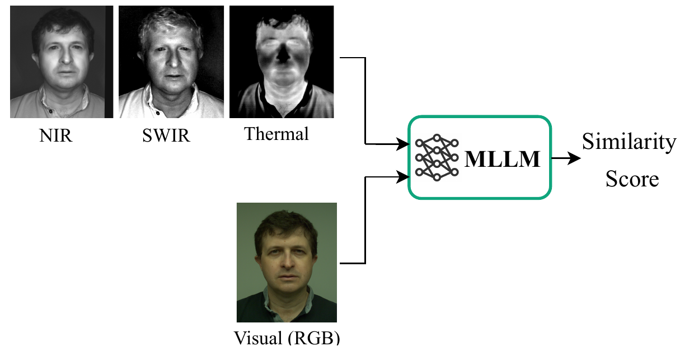

<!--
SPDX-FileCopyrightText: Copyright © 2026 Idiap Research Institute <contact@idiap.ch>
SPDX-FileContributor: Hatef OTROSHI <hatef.otroshi@idiap.ch>
SPDX-FileContributor: Anjith GEORGE <anjith.george@idiap.ch>
SPDX-License-Identifier: MIT
-->

# Evaluating Multimodal Large Language Models for Heterogeneous Face Recognition

Source code for the paper "Evaluating Multimodal Large Language Models for Heterogeneous Face Recognition" (accepted at IJCB 2026).



```bibtex
@article{shahreza2026evaluating,
  title={Evaluating multimodal large language models for heterogeneous face recognition},
  author={Shahreza, Hatef Otroshi and George, Anjith and Marcel, S{\'e}bastien},
  journal={arXiv preprint arXiv:2601.15406},
  year={2026}
}
```

## Installation

```bash
git clone git@gitlab.idiap.ch:biometric/code.hfr_mllm.git
cd code.hfr_mllm

conda create -n vllm python=3.10 -y
conda activate vllm

pip install -r requirements.txt
```

Set a Hugging Face token if the model weights are gated, and point the caches at
local scratch (model downloads are large):

```bash
export HF_TOKEN=<your_hf_token>
export HF_HOME=/path/to/cache
export XDG_CACHE_HOME=/path/to/cache
```

## Data Preparation


Protocol files for three heterogeneous face recognition databases:
`cbsr-nir-vis2`, `polathermal` and `mcxface`.

### Preprocessing

The aligned 112x112 face crops are produced by:

**https://gitlab.idiap.ch/bob/bob.paper.tifs2022_hfr_prepended_domain_transformer/**

Follow that repository to obtain the raw databases and generate the
preprocessed output.

### Generate the images

Open `generate_image_crops.py` and set the paths in the `DATABASES` dict at the
top — for each database, `crop_root` (existing `.jpg` crops) and/or `h5_root`
(the `.h5` output of the pipeline above). Then run:

```bash
python generate_image_crops.py
```

This writes `CROPPED/<database>/CROPS/<SPATH>` for every image listed in
`Protocols/<database>/*.csv`.


## Usage

You can use `run.py` to run the pipeline and get scores for enrol/probe pairs with a given model:

```bash
python run.py \
  --base_dir /path/to/HFR_dataset \
  --model Qwen/Qwen3-VL-8B-Instruct \
  --enroll_modalities "VIS" \
  --probe_modalities "NIR" "SWIR" "THERMAL" \
  --positive_samples 1000 \
  --negative_samples 1000 \
  --output_dir ./results
```

`--base_dir` must contain `view2_1-enroll.csv` and `view2_1-probe.csv` (columns
`REFERENCE_ID`, `SPATH`) and a `CROPS/` folder with the cropped face images
(override with `--crop_dir`). Scores are written to
`<output_dir>/<pair>/<model>_<pair>_results.csv`.

Then compute the metrics over every CSV under `./results`:

```bash
python evaluate.py
```

This prints EER per file and writes a summary table to `accuracy_results.txt`.